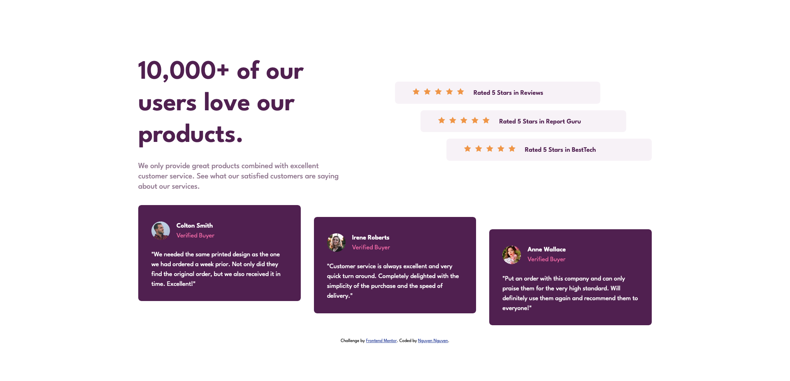

# Frontend Mentor - Social proof section solution

This is a solution to the [Social proof section challenge on Frontend Mentor](https://www.frontendmentor.io/challenges/social-proof-section-6e0qTv_bA). Frontend Mentor challenges help you improve your coding skills by building realistic projects.

## Table of contents

- [Overview](#overview)
  - [The challenge](#the-challenge)
  - [Screenshot](#screenshot)
  - [Links](#links)
- [My process](#my-process)
  - [Built with](#built-with)
  - [What I learned](#what-i-learned)
  - [Continued development](#continued-development)
  - [Useful resources](#useful-resources)
- [Author](#author)
- [Acknowledgments](#acknowledgments)

## Overview

### The challenge

Users should be able to:

- View the optimal layout for the section depending on their device's screen size

### Screenshot



### Links

- Solution URL: [View codes](https://github.com/jesuisbienbien/social-proof-section)
- Live Site URL: [View live site](https://jesuisbienbien.github.io/social-proof-section/)

## My process

### Built with

- Semantic HTML5 markup
- CSS custom properties
- Flexbox
- CSS Grid
- Mobile-first workflow

### What I learned

**_nth-child_**

```css
.five-star-rating:nth-child(2) {
  margin: 0 auto;
}
.five-star-rating:last-child {
  margin-left: auto;
}
```

**_grid_**

```css
main {
  max-width: 80%;
  display: grid;
  grid-template-columns: repeat(2, 1fr);
  grid-template-areas:
    "headings ratings"
    "testimonials testimonials";
}
```

### Continued development

### Useful resources

## Author

- Github - [Nguyen Nguyen](https://github.com/jesuisbienbien)
- Frontend Mentor - [@jesuisbienbien](https://www.frontendmentor.io/profile/jesuisbienbien)

## Acknowledgments
